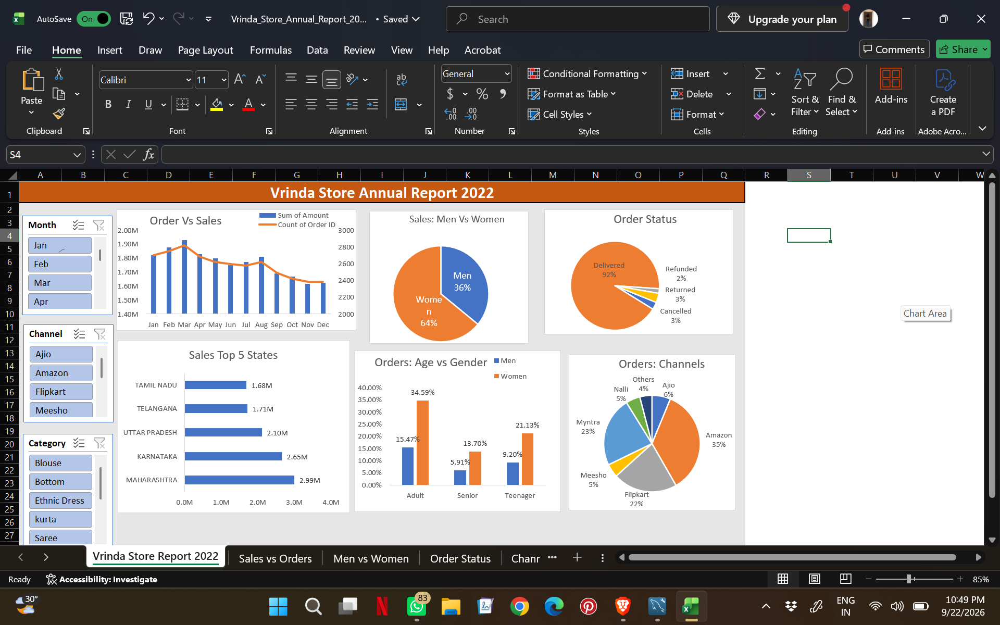

# Vrinda Store Annual Report 2022

Interactive Excel dashboard analyzing Vrinda Store sales and orders for 2022.

## 📊 Project Overview

This project presents an interactive Excel dashboard created to analyze
Vrinda Store's sales and order performance for the year 2022.

The dashboard provides insights into sales trends, customer demographics,
order status, top-performing states, and sales channels.

## 🛠️ Tools & Technologies

- Microsoft Excel
- Pivot Tables
- Pivot Charts
- Slicers
- Data Cleaning
- Data Analysis
- Dashboard Design
- Excel Formulas

## 📌 Dashboard

## 📈 Key Analysis

The dashboard analyzes:

- Monthly sales and order trends
- Sales contribution by gender
- Order status distribution
- Top 5 states by sales
- Orders by age group and gender
- Orders by sales channel
- Category and monthly performance

## 🔍 Key Insights

- Women contributed a larger share of sales than men.
- Amazon was the largest order channel.
- Maharashtra was among the top-performing states.
- The majority of orders were successfully delivered.
- Adult customers represented a significant portion of orders.

## 🎯 Business Objective

The objective of this dashboard is to help the business understand
customer behavior, sales performance, order trends, and channel
performance so that future marketing and sales strategies can be
data-driven.

## 📂 Project Files

| File | Description |
|---|---|
| `Vrinda_Store_Annual_Report_2022.xlsx` | Complete Excel dashboard and analysis |
| `dashboard.png` | Dashboard preview |

## 👩‍💻 Skills Demonstrated

- Data Cleaning
- Data Analysis
- Excel Dashboard Development
- Pivot Tables
- Data Visualization
- Business Insights
- Interactive Slicers
